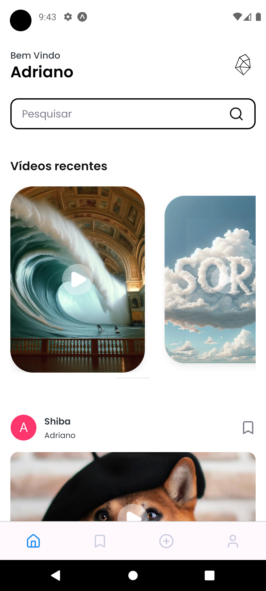

# Prism

 

Prism é um app em React Native para pessoas compartilharem vídeos criados por inteligência artificial. Ele utiliza [appwrite](https://appwrite.io/) para armazenamento, [nativewind](https://nativewind.dev/) para estilização e [expo-router](https://expo.dev/docs/versions/latest/routing/overview/) para roteamento.

## Instalação

1. Clone este repositório.
2. Instale as dependências com `npm install`.
3. Adicione as configurações do appwrite em appwrite.ts.
3. Inicie o app com `expo start`.
